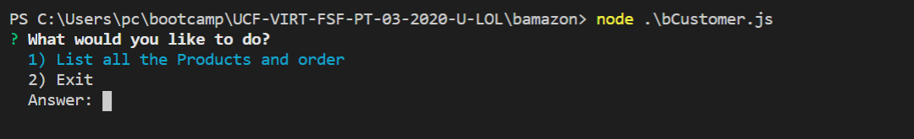

# bamazon

## Overview

This project creates a storefront CLI app. The app will take in orders from customers and deplete stock from the store's inventory. It will also track product sales across the store's departments and then provide a summary of the highest-grossing departments in the store.

## Installation

Run npm install to install the required packages

```
npm install
```

Run the below sql in mysql database to create the schema and the tables

```
bamazon_schema.sql
```

Import the below 2 csv file t5o populate the table

```
dept.csv
products.csv
```

## Commands for CLI App

### Customer Role

Run the folllowing :

```
node .\bCustomer.js
```

It will give an option to List the products and order the item you want.


