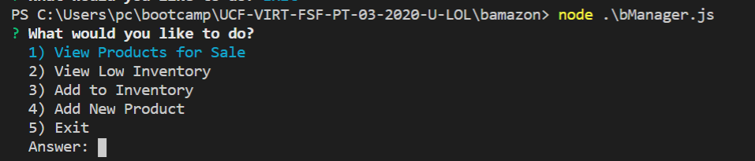
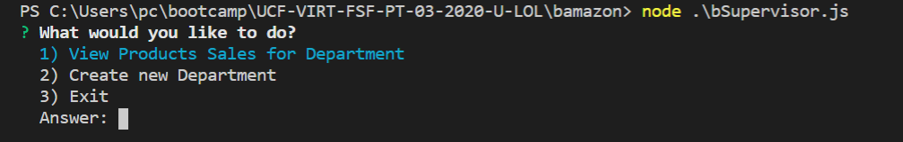

# bamazon

## Overview

This project creates a storefront CLI app. The app will take in orders from customers and deplete stock from the store's inventory. It will also track product sales across the store's departments and then provide a summary of the highest-grossing departments in the store.

## Installation

Run npm install to install the required packages

```
npm install
```

Run the below sql in mysql database to create the schema and the tables

```
bamazon_schema.sql
```

Import the below 2 csv file t5o populate the table

```
dept.csv
products.csv
```

## Commands for CLI App

### Customer Role

Run the folllowing :

```
node .\bCustomer.js
```

It will give an option to List the products and order the item you want.


### List all products and order

This option will list all the products and ask the user to enter the item id and the quantity.
If there is insufficient quantity , the app will display the available quantity and will inform the user on when he can order the extra amount. This is done using the fulfillment time in the products table

Once the order is placed and there is sufficient invnetory , the products table is update the available inventory and product sales

The user is presented with the same option set again till he/she choses exit option

### Exit

This option will exit the program .

### Manager Role

Run the folllowing :

```
node .\bManager.js
```

It will give options as shown in the figure below.



- View Products for Sale
  When a manager selects `View Products for Sale`, the app should list every available item: the item IDs, names, prices, quantities , product_sales.

- View Low Inventory
  When a manager selects `View Low Inventory`, then it should list all items with an inventory count lower than five.

- Add to Inventory
  When a manager selects `Add to Inventory`, your app should display a prompt that will let the manager "add more" of any item currently in the store.

- Add New Product
  When a manager selects `Add New Product`, it should allow the manager to add a completely new product to the store.

### Supervisor Role

Run the folllowing :

```
node .\bSupervisor.js
```

It will give the options as shown in the figure below.



- View Product Sales by Department
  When a supervisor selects `View Product Sales by Department`, the app should display a summarized table
  of total product sales and profit per department

- Create New Department
  When a supervisor selects `Create New Department`, the app should allow a new department to be created.

### video is attached in a zipped file in this dir
